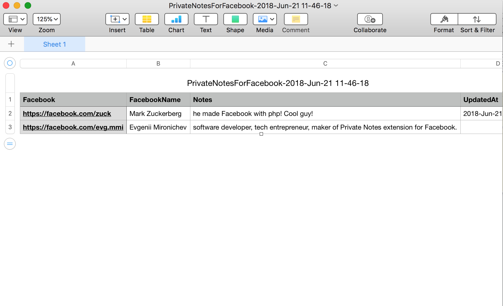

# Private Notes for Facebook - Chrome Extension

## Add To Chrome Browser

User this link to plugin in Google Chrome Store to add plugin to your browser:

https://chrome.google.com/webstore/detail/private-notes-for-faceboo/kaanknncpllnfglggklkilmmpiccdfem

## Purpose

Make it easier to store small notes about your connections on Facebook.

Screenshot:

Short demo:

Export to CSV:

## Implementation

Chrome extension plugin for Google Chrome that is doing the following:

- background.js monitors tabs for changes and sends message to content.js
- content.ks injects yellow note when a profile page opened
- when you change text in the note textarea it is automatically saved into local storage as JSON
- popup.js / popup.html displays all saved notes. Also generates data for CSV file format export 

## To Do

- auto-insert small icons with notes to be displayed as hints for profiles with notes.

## License

MIT License
Copyright (c) 2018 Evgenii Mironichev
https://twitter.com/emirnic

